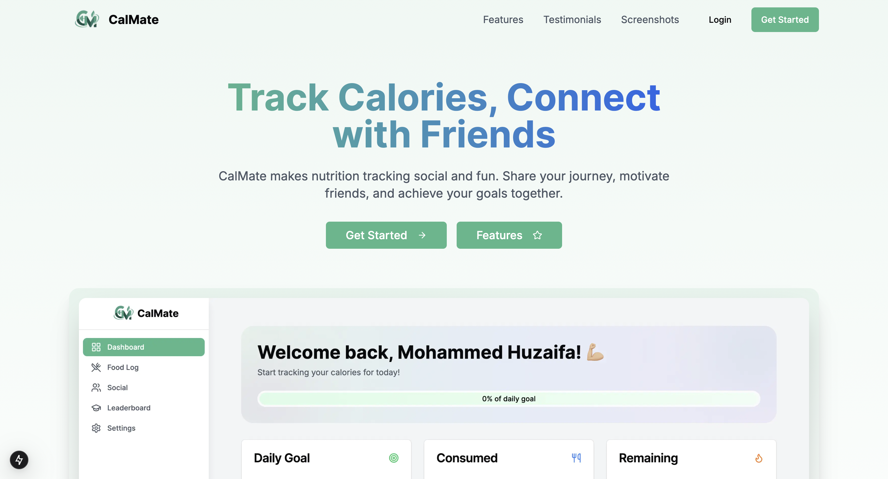

# CalMate - Next.js Frontend 🏃‍♂️



A modern fitness tracking application built with Next.js 15, React 19, and TypeScript, focused on calorie counting and social fitness features.

## 🛠️ Tech Stack

- **Framework**: Next.js 15.1.0
- **UI**: React 19.0.0
- **Styling**: Tailwind CSS
- **Forms**: React Hook Form with Zod validation
- **Animation**: Framer Motion
- **UI Components**: Radix UI primitives
- **HTTP Client**: Axios
- **Charts**: Recharts

## 📁 Project Structure

```
.
├── src/
│   ├── app/           # Next.js app router pages
│   ├── components/    # React components
│   ├── contexts/      # React context providers
│   ├── hooks/         # Custom React hooks
│   ├── lib/           # Utility functions
│   └── types/         # TypeScript types
├── public/            # Static assets
├── middleware.ts      # Next.js middleware
├── next.config.ts     # Next.js configuration
└── tailwind.config.ts # Tailwind CSS configuration
```

## 🚀 Getting Started

1. Install dependencies:
```bash
npm install
```

2. Set up environment variables:
```env
NEXT_PUBLIC_API_URL=http://localhost:8000
```

3. Run development server:
```bash
npm run dev
```

## 📦 Available Scripts

```bash
npm run dev      # Start development server
npm run build    # Build for production
npm run start    # Start production server
npm run lint     # Run ESLint
```

## 🔧 Core Features

### UI Components
The application includes:
- Responsive layout with Tailwind CSS
- Form components with React Hook Form
- Progress indicators using Radix UI
- Animated transitions with Framer Motion
- Data visualization with Recharts

### Data Management
The app handles data through:
- Form validation using Zod
- API integration with Axios
- Cookie management with js-cookie

## 🎨 Styling

The styling system uses:
- Tailwind CSS for utility classes
- `class-variance-authority` for component variants
- `tailwind-merge` for class merging
- `tailwindcss-animate` for animations

Here's an example component with styling:
```tsx
import { cn } from "@/lib/utils"
import { Button } from "@/components/ui/button"

export function MyComponent({ className }: { className?: string }) {
  return (
    <Button 
      className={cn("bg-primary hover:bg-primary/90", className)}
    >
      Click Me
    </Button>
  )
}
```

## 🔒 Type Safety

The project implements TypeScript for type safety. Here are example types from `src/types/`:

```typescript
interface User {
  id: string;
  name: string;
  email: string;
  calorieGoal: number;
}

interface FoodEntry {
  id: string;
  userId: string;
  calories: number;
  timestamp: Date;
}
```

## 📱 Responsive Design

The app follows these breakpoints:
```css
sm: '640px'   /* Mobile */
md: '768px'   /* Tablet */
lg: '1024px'  /* Desktop */
xl: '1280px'  /* Large Desktop */
```

## 🤝 Contributing

1. Fork the repository
2. Create your feature branch
3. Commit your changes
4. Push to the branch
5. Create a Pull Request

## 📮 Support

For support, email [huzaifa.coder785@gmail.com](mailto:huzaifa.coder785@gmail.com)

## 🔗 Links

- [Backend Repository](https://github.com/Huzaifa785/calmate-backend)
- [Live Demo](https://calmate-app.vercel.app)

## Credits

- [claude.ai 🔥](https://claude.ai/): Used for brainstorming, designing UI and follwing best practices.
